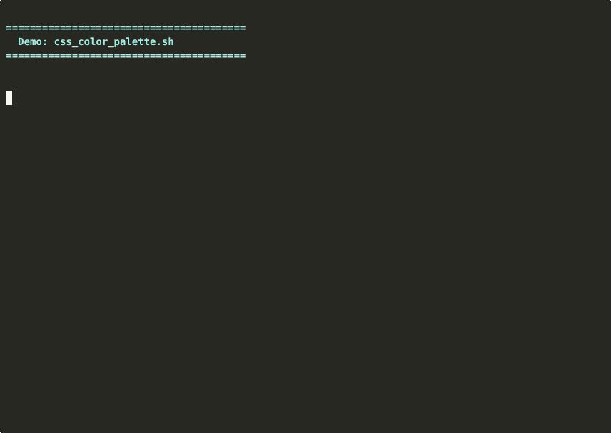
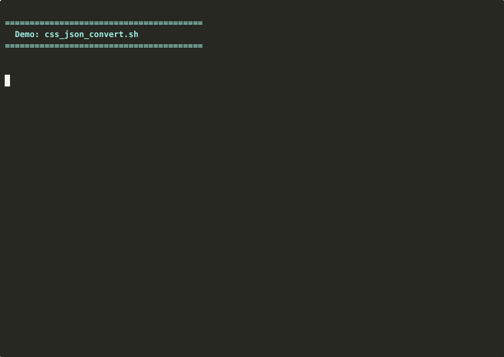
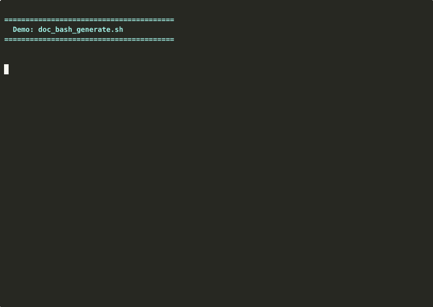
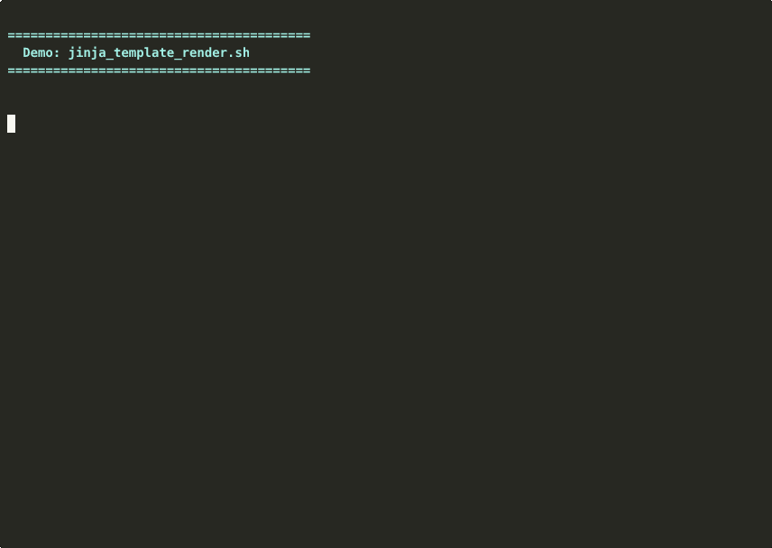
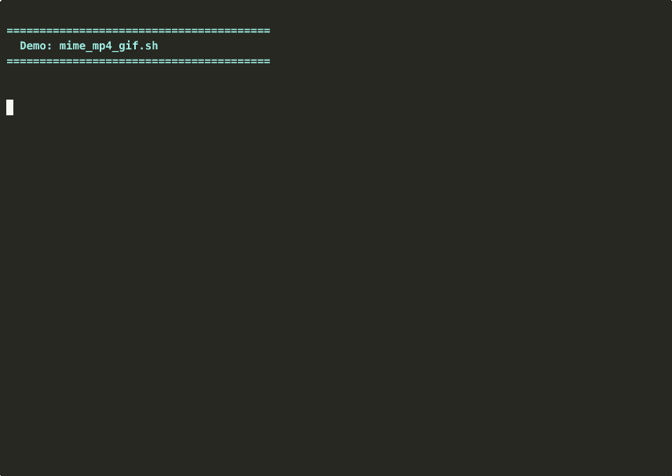

# Utility Scripts Collection

> Comprehensive documentation with usage examples and demos

This documentation was auto-generated using [`doc_bash_generate.sh`](https://github.com/yourusername/yourrepo).

## Table of Contents
- [`artifact_github_download.sh`](#artifact-github-download-sh)
- [`css_color_filter.sh`](#css-color-filter-sh)
- [`css_color_palette.sh`](#css-color-palette-sh)
- [`css_json_convert.sh`](#css-json-convert-sh)
- [`doc_bash_generate.sh`](#doc-bash-generate-sh)
- [`doc_rust_generate.sh`](#doc-rust-generate-sh)
- [`jinja_template_render.sh`](#jinja-template-render-sh)
- [`mime_mp4_gif.sh`](#mime-mp4-gif-sh)


---

## `artifact_github_download.sh`

GitHub Artifact Downloader

### Demo


### Usage

```bash
artifact_github_download.sh [OPTIONS] [ARGUMENTS]
```

### Options

<details>
<summary>Click to expand full help output</summary>

```
GitHub Artifact Downloader

USAGE:
    artifact_github_download.sh <REPO> [OPTIONS]

ARGUMENTS:
    REPO                GitHub repository (owner/repo)

OPTIONS:
    -n, --name NAME     Artifact name to download (preselect)
    -o, --output DIR    Output directory (default: current directory)
    -h, --help          Show this help message

EXAMPLES:
    # Interactive mode - list and select artifacts
    artifact_github_download.sh valknarness/awesome

    # Preselect artifact by name
    artifact_github_download.sh valknarness/awesome -n awesome-database-latest

    # Download to specific directory
    artifact_github_download.sh valknarness/awesome -o ~/downloads

    # Combine options
    artifact_github_download.sh valknarness/awesome -n awesome-database-latest -o ~/downloads
```

</details>

### Examples

```bash
# Interactive mode - list and select artifacts
artifact_github_download.sh valknarness/awesome

# Preselect artifact by name
artifact_github_download.sh valknarness/awesome -n awesome-database-latest

# Download to specific directory
artifact_github_download.sh valknarness/awesome -o ~/downloads

# Combine options
artifact_github_download.sh valknarness/awesome -n awesome-database-latest -o ~/downloads
```

---

## `css_color_filter.sh`

CSS Color Filter Generator

### Demo


### Usage

```bash
css_color_filter.sh [OPTIONS] [ARGUMENTS]
```

### Options

<details>
<summary>Click to expand full help output</summary>

```
CSS Color Filter Generator

Generate CSS filter values to transform black elements into any target color.

USAGE:
    css_color_filter.sh [OPTIONS] [COLOR]

ARGUMENTS:
    COLOR               Hex color (e.g., #FF0000, ff0000) or RGB (e.g., 255,0,0)

OPTIONS:
    -i, --interactive   Interactive mode with colored preview
    -r, --raw           Output only the CSS filter (for piping)
    -c, --copy          Copy result to clipboard automatically
    -h, --help          Show this help message

EXAMPLES:
    css_color_filter.sh "#FF5733"
    css_color_filter.sh ff5733
    css_color_filter.sh "255,87,51"
    css_color_filter.sh -i

NOTE:
    This tool generates filters that work on black elements.
    To use with non-black elements, prepend: brightness(0) saturate(100%)

ALGORITHM:
    Uses SPSA (Simultaneous Perturbation Stochastic Approximation) to find
    optimal filter combinations that minimize color difference in RGB and HSL.

DEPENDENCIES:
    bc                  For floating-point arithmetic
    jq                  For JSON formatting (optional)
```

</details>

### Examples

```bash
css_color_filter.sh "#FF5733"
css_color_filter.sh ff5733
css_color_filter.sh "255,87,51"
css_color_filter.sh -i
```

---

## `css_color_palette.sh`

CSS Color Palette Generator (Pure Bash)

### Demo



### Usage

```bash
css_color_palette.sh [OPTIONS] [ARGUMENTS]
```

### Options

<details>
<summary>Click to expand full help output</summary>

```
CSS Color Palette Generator (Pure Bash)

Generate comprehensive color palettes without Node.js dependencies.

USAGE:
    css_color_palette.sh COLOR [OPTIONS]

ARGUMENTS:
    COLOR               Base hex color (e.g., #3498db, 3498db)

OPTIONS:
    -p, --palette TYPE  Palette type: monochromatic, analogous, complementary,
                        split-complementary, triadic, tetradic
    -o, --output FILE   Output file (default: ./colors.yaml)
    -m, --mode MODE     Color mode: light, dark (default: light)
    -s, --style STYLE   Style: shades, tints, tones, all (default: all)
    -n, --name NAME     Palette name (default: auto-generated)
    --scales N          Number of scale steps (default: 11)
    -i, --interactive   Interactive mode
    -v, --verbose       Verbose output with color preview
    -h, --help          Show this help message

DEPENDENCIES:
    bc                  For floating-point arithmetic

EXAMPLES:
    css_color_palette.sh "#3498db"
    css_color_palette.sh "#3498db" -p triadic -o palette.json
    css_color_palette.sh "ff5733" -p analogous -m dark
```

</details>

### Examples

```bash
css_color_palette.sh "#3498db"
css_color_palette.sh "#3498db" -p triadic -o palette.json
css_color_palette.sh "ff5733" -p analogous -m dark
```

---

## `css_json_convert.sh`

USAGE:

### Demo



### Usage

```bash
css_json_convert.sh [OPTIONS] [ARGUMENTS]
```

### Options

<details>
<summary>Click to expand full help output</summary>

```

================================================================
  CSS Variable to JSON/YAML Converter
  Extract CSS custom properties with ease
================================================================

USAGE:
    css_json_convert.sh [OPTIONS] <input.css>

DESCRIPTION:
    Extracts CSS custom properties (variables) from a CSS file and converts
    them to JSON or YAML format. Automatically detects output format from
    file extension.

ARGUMENTS:
    <input.css>              Input CSS file containing CSS variables

OPTIONS:
    -o, --output FILE        Output file path (default: ./output.yaml)
                             Format auto-detected from extension (.json/.yaml/.yml)
    -c, --camel-case         Convert variable names to camelCase
                             (e.g., --main-color -> mainColor)
    -v, --verbose            Enable verbose output
    -h, --help               Show this help message

EXAMPLES:
    # Extract CSS vars to YAML (default)
    css_json_convert.sh styles.css

    # Extract to JSON with custom output
    css_json_convert.sh styles.css -o theme.json

    # Convert variable names to camelCase
    css_json_convert.sh styles.css -o vars.json --camel-case

CSS VARIABLE FORMAT:
    The script extracts CSS custom properties in the format:
        --variable-name: value;

    Example input:
        :root {
          --main-color: #e8eaed;
          --font-size: 16px;
        }

    Example JSON output:
        {
          "main-color": "#e8eaed",
          "font-size": "16px"
        }
```

</details>

### Examples

```bash
# Extract CSS vars to YAML (default)
css_json_convert.sh styles.css

# Extract to JSON with custom output
css_json_convert.sh styles.css -o theme.json

# Convert variable names to camelCase
css_json_convert.sh styles.css -o vars.json --camel-case
```

---

## `doc_bash_generate.sh`

Bash Documentation Generator with Animated GIFs

### Demo



### Usage

```bash
doc_bash_generate.sh [OPTIONS] [ARGUMENTS]
```

### Options

<details>
<summary>Click to expand full help output</summary>

```

================================================================
  Bash Documentation Generator
================================================================

Bash Documentation Generator with Animated GIFs

Generate sexy, comprehensive README.md files with embedded asciinema GIFs.

USAGE:
    doc_bash_generate.sh [OPTIONS] <executable> [executable...]

ARGUMENTS:
    executable          One or more executables or glob patterns

OPTIONS:
    -o, --output FILE   Output README.md path (default: ./README.md)
    -t, --title TITLE   Documentation title (default: auto-generated)
    --no-gif            Skip GIF generation (faster, text only)
    --gif-only          Only generate GIFs, don't update README
    -h, --help          Show this help message

EXAMPLES:
    doc_bash_generate.sh css_*.sh
    doc_bash_generate.sh -o docs/README.md *.sh
    doc_bash_generate.sh --title "My Awesome Tools" script1.sh script2.sh

DEPENDENCIES:
    asciinema           Terminal session recorder
    agg                 Asciinema to GIF converter (cargo install agg)

NOTES:
    Demos are automatically generated by running --help on each command.
    GIF recordings are created in a temporary directory and cleaned up after.
```

</details>

### Examples

```bash
doc_bash_generate.sh css_*.sh
doc_bash_generate.sh -o docs/README.md *.sh
doc_bash_generate.sh --title "My Awesome Tools" script1.sh script2.sh
```

---

## `doc_rust_generate.sh`

Rust Documentation Generator with Custom Themes

### Demo


### Usage

```bash
doc_rust_generate.sh [OPTIONS] [ARGUMENTS]
```

### Options

<details>
<summary>Click to expand full help output</summary>

```
Rust Documentation Generator with Custom Themes

USAGE:
    doc_rust_generate.sh [OPTIONS] <inputs...>

DESCRIPTION:
    Generate beautiful Rust documentation with custom color schemes and styling.
    Supports various input types including Rust projects, individual files, and more.

ARGUMENTS:
    <inputs>                 Input file(s) or pattern(s) to document:
                             - Rust project directories (containing Cargo.toml)
                             - Individual .rs files
                             - Markdown files (.md)
                             - JSON/TOML configuration files
                             - Glob patterns (e.g., src/**/*.rs)

OPTIONS:
    -o, --output DIR         Output directory for generated docs
                             (default: $PWD/output)
    -c, --color COLOR        Primary accent color (hex format)
                             (default: #ff69b4)
                             Examples: #3498db, #10b981, #8b5cf6
    -s, --style STYLE        Background style theme
                             Options: slate, zinc, neutral, stone, gray
                             (default: slate)
    --font-sans FONT         Google Font for body text (default: Inter)
    --font-mono FONT         Google Font for code blocks
                             (default: JetBrains Mono)
    --serve                  Start HTTP server after generation
    --open                   Open documentation in browser (implies --serve)
    -p, --port PORT          Port for HTTP server (default: 8000)
    -v, --verbose            Enable verbose output
    -d, --dry-run            Show what would be done without executing
    -h, --help               Show this help message

EXAMPLES:
    # Generate docs for current Rust project
    doc_rust_generate.sh .

    # Custom color scheme
    doc_rust_generate.sh . -c "#3498db" -s zinc -o ./docs

    # Document specific files
    doc_rust_generate.sh src/lib.rs src/main.rs -o ./api-docs

    # Use custom fonts
    doc_rust_generate.sh . --font-sans "Roboto" --font-mono "Fira Code"

    # Generate and open in browser
    doc_rust_generate.sh . --open

NOTES:
    - Requires: cargo, rustdoc, bc, yq, jq, python3 with jinja2
    - Colors are automatically generated in light and dark variants
    - Google Fonts are automatically imported
    - Mermaid.js diagrams are automatically rendered
```

</details>

### Examples

```bash
# Generate docs for current Rust project
doc_rust_generate.sh .

# Custom color scheme
doc_rust_generate.sh . -c "#3498db" -s zinc -o ./docs

# Document specific files
doc_rust_generate.sh src/lib.rs src/main.rs -o ./api-docs

# Use custom fonts
doc_rust_generate.sh . --font-sans "Roboto" --font-mono "Fira Code"

# Generate and open in browser
doc_rust_generate.sh . --open
```

---

## `jinja_template_render.sh`

JINJA2 TEMPLATE RENDERER - NINJA EDITION

### Demo



### Usage

```bash
jinja_template_render.sh [OPTIONS] [ARGUMENTS]
```

### Options

<details>
<summary>Click to expand full help output</summary>

```
JINJA2 TEMPLATE RENDERER - NINJA EDITION

USAGE:
    jinja_template_render.sh [OPTIONS] <template> [template...]

DESCRIPTION:
    A sophisticated Jinja2 template rendering engine with support for
    multiple variable sources, glob patterns, and ninja-style operations.

ARGUMENTS:
    <template>               Template file(s) to render (glob patterns supported)
                             Examples: template.j2, templates/*.j2, **/*.jinja2

OPTIONS:
    -o, --output DIR         Output directory (default: ./output)
    -v, --var KEY=VALUE      Define template variable (can be used multiple times)
    -f, --file FILE          Load variables from JSON/YAML file (repeatable)
    -V, --verbose            Enable verbose ninja commentary
    -p, --preview            Preview rendered output without saving
    -s, --strict             Enable strict mode (fail on undefined variables)
    -d, --dry-run            Perform dry run without writing files
    -w, --watch              Watch templates and re-render on changes (experimental)
    -h, --help               Show this legendary scroll of knowledge

VARIABLE SOURCES:
    Variables are merged in this order (later sources override earlier):
    1. YAML files (loaded via yq)
    2. JSON files (loaded via jq)
    3. CLI variables (-v KEY=VALUE)

EXAMPLES:
    # Render single template with CLI variables
    jinja_template_render.sh template.j2 -v name=Ninja -v level=Master

    # Render multiple templates with YAML config
    jinja_template_render.sh templates/*.j2 -f config.yaml -o dist/

    # Render with multiple variable sources
    jinja_template_render.sh app.j2 -f base.yaml -f env.json -v debug=true

    # Preview without saving
    jinja_template_render.sh template.j2 -f vars.yaml --preview --verbose

    # Strict mode with dry run
    jinja_template_render.sh *.j2 -f vars.json --strict --dry-run

TEMPLATE SYNTAX:
    Jinja2 template example:
    
    Hello {{ name }}!
    
      - {{ item }}
    
    Debug mode enabled
    

REQUIREMENTS:
    - Python 3 with jinja2 package
    - jq (for JSON parsing)
    - yq (for YAML parsing)

[NINJA] May your templates be swift and your renders be flawless! >>
```

</details>

### Examples

```bash
# Render single template with CLI variables
jinja_template_render.sh template.j2 -v name=Ninja -v level=Master

# Render multiple templates with YAML config
jinja_template_render.sh templates/*.j2 -f config.yaml -o dist/

# Render with multiple variable sources
jinja_template_render.sh app.j2 -f base.yaml -f env.json -v debug=true

# Preview without saving
jinja_template_render.sh template.j2 -f vars.yaml --preview --verbose

# Strict mode with dry run
jinja_template_render.sh *.j2 -f vars.json --strict --dry-run
```

---

## `mime_mp4_gif.sh`

Usage: mime_mp4_gif.sh [OPTIONS] INPUT_FILE [OUTPUT_FILE]

### Demo



### Usage

```bash
mime_mp4_gif.sh [OPTIONS] [ARGUMENTS]
```

### Options

<details>
<summary>Click to expand full help output</summary>

```
Usage: mime_mp4_gif.sh [OPTIONS] INPUT_FILE [OUTPUT_FILE]

Convert MP4 videos to animated GIFs with advanced frame extraction algorithms.

Arguments:
    INPUT_FILE              Input MP4 video file (required)
    OUTPUT_FILE             Output GIF file (optional, defaults to INPUT_FILE.gif)

Options:
    -k, --keyframes N       Number of keyframes to extract (default: 10)
    -d, --keyframe-duration MS  Duration of each frame in milliseconds (default: 100)
                            Valid range: 1-30000 ms
                            Lower values = faster animation
                            Higher values = slower animation
    -i, --input-schedules N Number of input schedules (default: 1)
                            1 schedule = entire video duration
                            N schedules = divide video into N segments
    -t, --transition TYPE   Interpolation function for frame timing
                            Available: linear sinoid cubic quadratic exponential bounce elastic
                            (default: linear)
    -s, --schedule TYPE     Algorithm to distribute keyframes across schedules
                            Available: uniform front-load back-load center-peak edge-peak fibonacci golden-ratio
                            (default: uniform)
    -m, --magic TYPE        Apply magical effects to the GIF
                            Available: none psychedelic dither-bloom edge-glow temporal-blur chromatic-shift vaporwave
                            (default: none)
    -v, --verbose           Enable verbose output
    -h, --help              Show this help message

Examples:
    # Basic conversion with 15 keyframes
    mime_mp4_gif.sh -k 15 video.mp4

    # Fast animation with 50ms per frame
    mime_mp4_gif.sh -k 20 -d 50 video.mp4

    # Slow animation with 500ms per frame
    mime_mp4_gif.sh -k 10 -d 500 video.mp4

    # Use sinusoidal transition with center-peak distribution
    mime_mp4_gif.sh -t sinoid -s center-peak -k 20 video.mp4

    # Apply psychedelic magic with fibonacci distribution
    mime_mp4_gif.sh -m psychedelic -s fibonacci -k 13 video.mp4 trippy.gif

    # Complex: 3 schedules with cubic interpolation and edge glow
    mime_mp4_gif.sh -i 3 -t cubic -s front-load -m edge-glow -k 30 video.mp4
```

</details>

---

## Installation

All scripts are available in this repository. Make sure they are executable:

```bash
chmod +x *.sh
```

Add them to your PATH for easy access:

```bash
export PATH="$PATH:$(pwd)"
```

## Dependencies

Common dependencies for these scripts:
- `bash` (4.0+)
- `bc` - For floating-point arithmetic

Specific dependencies are listed in each command's help output.

## Contributing

Contributions are welcome! Please ensure:
- Scripts follow POSIX conventions
- Include comprehensive `--help` output with usage examples

## License

MIT License - See LICENSE file for details.

---

*Documentation generated on 2025-10-30 02:59:22 CET by [`doc_bash_generate.sh`](https://github.com/yourusername/yourrepo)*
